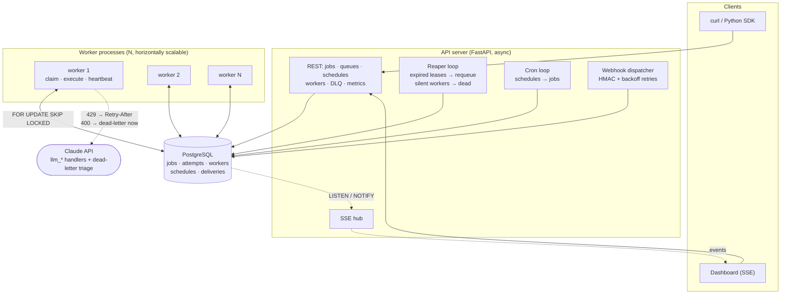
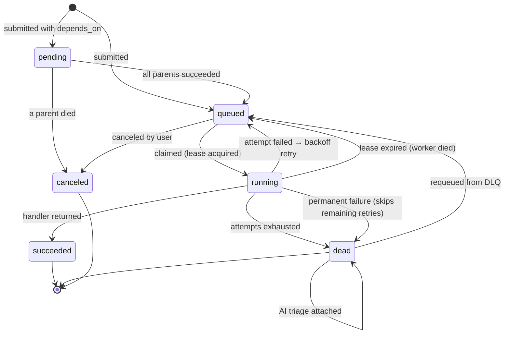

# ⚡ Taskforge

**A distributed job execution platform** — the infrastructure that sits behind "send this
email in the background", "generate this thumbnail", "retry that API call until it works".
Think a miniature Celery / Sidekiq / AWS SQS+Lambda, built from first principles on
PostgreSQL.

[](https://github.com/tusharbhatt7/taskforge/actions/workflows/ci.yml)


🔗 **Live demo:** _(add your Render URL here)_ · **API docs:** `/docs` · demo login `demo@taskforge.dev` / `demo1234`

---

## The problem it solves

Any application that does work in the background eventually needs the same guarantees:
work must not be lost when a machine dies, transient failures must be retried without
hammering a broken dependency, permanently broken work must be quarantined rather than
retried forever, and someone must be able to see what happened. Taskforge implements
those guarantees.

**The demo that matters:** click *Kill a random worker* in the dashboard while jobs are
running. The worker dies hard — `os._exit()`, no cleanup, no lease release, like a
yanked power cable. Its leases expire, the reaper reclaims the orphaned jobs, and a
surviving worker finishes them. **No job is lost, no human intervenes.**

## What it does

| Capability | How |
|---|---|
| **At-least-once execution** | Jobs are claimed under `FOR UPDATE SKIP LOCKED`; no two workers can ever hold the same job |
| **Crash recovery** | Every claim carries a time-bound lease; workers renew while executing, and the reaper requeues whatever a dead worker was holding |
| **Retries with backoff** | Exponential backoff with full jitter (`min(cap, base·2ⁿ) × U(0.5, 1.5)`) so a fleet failing together doesn't retry in lockstep |
| **Dead-letter queue** | Jobs that exhaust their attempt budget are quarantined with full error history, and can be requeued from the UI |
| **Priorities & delays** | Higher priority claimed first; `run_at` / `delay_seconds` schedules work into the future |
| **Job dependencies** | A job can depend on others; it stays `pending` until all parents succeed, and a dead parent cancels the whole subtree |
| **Cron schedules** | `croniter`-backed recurring jobs with drift-safe advancement (6 hours of downtime ≠ 360 queued jobs) |
| **Idempotent submission** | An `idempotency_key` makes retried API calls safe — enforced by a unique partial index, so even concurrent duplicates collapse to one job |
| **Signed webhooks** | Terminal states POST an HMAC-SHA256-signed callback, retried with backoff, every attempt logged |
| **Live dashboard** | Server-Sent Events over Postgres `LISTEN/NOTIFY` stream every state change to the browser in real time |
| **Multi-tenancy** | Per-user data isolation, JWT for the dashboard, hashed API keys for programmatic access, rate limiting on credential endpoints |
| **Observability** | Queue depths, throughput, success rate, and p50/p95/p99 execution latency via `percentile_cont` |
| **Permanent vs retryable failures** | A handler can declare a failure unretryable (bad payload, revoked key) so it dead-letters immediately instead of burning its retry budget, or hand back a server-supplied `Retry-After` that overrides our backoff |
| **AI job types** | `llm_summarize` / `llm_classify` / `llm_extract` run Claude calls as queued work, with schema-constrained JSON output and per-job token/cost accounting |
| **AI failure triage** | When a job dead-letters, the platform analyses its own dead-letter queue: category, transient-or-permanent, root cause, suggested action — deduplicated by error fingerprint so an outage costs one API call, not hundreds |

## Architecture



### Job lifecycle



## Design decisions

These are the questions an interviewer will ask, so they're answered up front.

**Why PostgreSQL as the queue instead of Redis, RabbitMQ or SQS?**
Because the jobs *are* business state, and a separate broker forces a distributed
transaction you cannot actually make atomic: if you commit a database row and then push
to Redis, a crash between the two either loses the job or creates a phantom one. With the
queue in the same database, enqueueing is part of the ordinary transaction that created
the work — it commits or it doesn't. Postgres also gives durability, crash recovery,
`SKIP LOCKED` for lock-free concurrent claiming, and SQL for the dashboard's analytics,
all in one system with no extra operational surface. This is the same choice made by
Oban (Elixir), Solid Queue (Rails, which explicitly moved *off* Redis) and pg-boss
(Node). The trade-off is real: Postgres tops out around low thousands of jobs/second,
where a dedicated broker reaches millions. At that scale I'd move the hot path to a
broker and keep Postgres as the system of record.

**Why at-least-once instead of exactly-once?**
Exactly-once delivery is impossible across a process boundary — a worker can always die
in the window between finishing work and recording that it finished, and no protocol
removes that window. The honest options are at-most-once (fast, loses work) or
at-least-once (never loses work, may duplicate). I chose at-least-once and pushed
deduplication to where it can actually be solved: `idempotency_key` on submission, and
handlers that are safe to re-run. This is the same contract SQS and Celery offer.

**How is the claim query safe under concurrency?**
`SELECT … FOR UPDATE SKIP LOCKED` locks candidate rows and *skips* any row another
transaction already locked, instead of blocking on it. Five workers running the query
simultaneously get five disjoint sets of jobs with no coordinator, no distributed lock,
and no waiting. It's covered by a test that runs five real concurrent claimers against
real Postgres and asserts every job was claimed exactly once.

**Why a partial index?**
```sql
CREATE INDEX ix_jobs_claim ON jobs (queue, priority DESC, run_at) WHERE state = 'queued';
```
The claim query only ever looks at `queued` rows, which are a tiny minority — most rows
are finished history. Indexing only that subset keeps the index small and cache-resident
no matter how much history accumulates, and rows drop out of the index as they complete.

**Why leases instead of just tracking which worker has a job?**
A worker that crashes can't tell anyone. A lease inverts the responsibility: instead of
the dead worker announcing failure, the live worker must keep proving it's alive by
renewing. Silence is the failure signal. The lease duration is the tunable trade-off
between fast recovery and tolerance for a briefly stalled worker (GC pause, slow query) —
which is why renewal only touches rows still owned by that worker, so a worker waking
from a long stall can never steal back a job the reaper already reassigned.

**Why jitter on retries?**
Without it, a downstream outage that fails 500 jobs simultaneously would retry all 500
at the same instant, re-failing together and hammering a service that's trying to
recover. Full jitter spreads them across a window.

**Why is AI in a job queue project at all?**
Because LLM calls are the textbook workload for one. They take seconds to minutes, they
are hard rate-limited, and they fail transiently — run one inline in a request handler and
the user waits, then a 429 becomes a user-visible error. Moving them here means the
existing backoff, retry and dead-letter machinery applies unchanged. It also pushed two
genuine engine features that the demo handlers never needed: a **permanent** failure
(a 400 will fail identically on every retry, so dead-letter it now rather than three
attempts later) and a **server-directed retry delay** (a 429 carrying `Retry-After: 30`
means retrying at 5s is guaranteed to fail *and* spends another request against the limit).

**Why does the platform triage its own dead-letter queue?**
A dead-letter queue answers "what failed" but not "why, and what do I do about it".
Triage fills that in, and it runs *as a job on the platform* — same claiming, leasing,
retries and dead-lettering as any other work, on a dedicated `triage` queue so pausing a
business queue never stops ops tooling. Two details carry most of the engineering:

- **A loop guard.** Triage is never enqueued for a triage job. Without it a failing
  triage handler dead-letters, enqueues triage for itself, dead-letters again — an
  unbounded loop that spends real money.
- **Fingerprint deduplication.** One broken dependency dead-letters hundreds of jobs that
  all failed the same way. Errors are normalized (ids, numbers, timestamps, quoted strings
  stripped) into a fingerprint, and a job whose fingerprint is already explained reuses
  that analysis. Verified live: six simultaneous dead-letters of one signature produced
  **one** API call and five reuses.

That dedupe is a read-then-write race, and the first version had it: the triage jobs were
claimed in the same batch, every one read "no prior analysis" before any committed, and
every one paid. The fix is a transaction-scoped advisory lock on the fingerprint —
deliberately the *opposite* policy to job claiming, which uses `SKIP LOCKED` to avoid
waiting. There, contention means another worker owns the job and we should move on; here,
contention means the answer is already being computed and waiting is exactly what saves
the call.

**Why an in-process scheduler instead of Celery Beat or a separate service?**
Fewer moving parts, and the reaper/cron loops use `SKIP LOCKED` too — so running several
API instances is already safe without adding leader election. If any loop needed to
scale independently, it would extract into its own process without changing its logic.

## Running it locally

**Docker (everything: Postgres, API, 2 workers):**
```bash
docker compose up --build
```
Then seed demo data and open http://localhost:8000:
```bash
docker compose exec api python -m scripts.seed
```

**Without Docker** (needs a local PostgreSQL and [uv](https://docs.astral.sh/uv/)):
```bash
createdb taskforge
cp .env.example .env          # then edit DATABASE_URL if needed
uv sync
uv run alembic upgrade head
uv run python -m scripts.seed
uv run uvicorn app.main:app --reload      # terminal 1: API
uv run python -m app.worker                # terminal 2: worker
uv run python -m app.worker                # terminal 3: another worker
```

Log in with `demo@taskforge.dev` / `demo1234`.

**Generate a continuous workload** so the dashboard is always moving:
```bash
uv run python -m scripts.demo --rate 8
```

## Try the failure recovery yourself

```bash
# 1. Submit a long job and note which worker claims it
curl -s -X POST localhost:8000/api/v1/jobs \
  -H "X-API-Key: tf_live_..." -H "Content-Type: application/json" \
  -d '{"type": "sleep", "payload": {"seconds": 40}}'

# 2. Kill the worker holding it, mid-execution
curl -s -X POST localhost:8000/api/v1/workers/chaos/kill -H "X-API-Key: tf_live_..."

# 3. Watch the job get reclaimed and completed by a different worker
#    (attempts increments, leased_by changes, state ends as 'succeeded')
```
The job's attempt timeline in the dashboard records attempt 1 as **lost** (worker died)
rather than **failed** (handler raised) — a distinction that matters when you're deciding
whether your code is broken or your infrastructure is.

## API

```bash
# Submit
curl -X POST $URL/api/v1/jobs \
  -H "X-API-Key: tf_live_..." -H "Content-Type: application/json" \
  -d '{
    "type": "http_fetch",
    "payload": {"url": "https://example.com"},
    "queue": "default",
    "priority": 10,
    "max_attempts": 5,
    "delay_seconds": 0,
    "idempotency_key": "fetch-example-once",
    "callback_url": "https://your-app.com/hooks/taskforge"
  }'
```

Python SDK:
```python
from sdk.client import Taskforge

with Taskforge("https://your-app.onrender.com", api_key="tf_live_...") as tf:
    parent = tf.submit("thumbnail", {"width": 256, "height": 256})
    tf.submit("email_sim", {"to": "ops@example.com"}, depends_on=[parent["id"]])
    print(tf.wait(parent["id"])["result"])
```

Full interactive reference at `/docs`. Endpoints: `/auth/*`, `/api-keys`, `/jobs`,
`/jobs/{id}/cancel`, `/jobs/{id}/retry`, `/queues/{name}/pause|resume`, `/schedules`,
`/workers`, `/workers/chaos/kill`, `/webhook-deliveries`, `/metrics/overview`, `/stream`.

### Verifying a webhook

```python
import hmac, hashlib

def is_valid(body: bytes, signature: str, secret: str) -> bool:
    expected = "sha256=" + hmac.new(secret.encode(), body, hashlib.sha256).hexdigest()
    return hmac.compare_digest(expected, signature)  # constant-time
```

### Built-in job types

| Type | Payload | Purpose |
|---|---|---|
| `http_fetch` | `{"url": "...", "method": "GET"}` | Real network I/O; non-2xx raises, exercising retries. SSRF-guarded against private addresses |
| `thumbnail` | `{"image_url": "...", "width": 128, "height": 128}` | CPU-bound Pillow resize, run in a thread so it can't stall the event loop |
| `email_sim` | `{"to": "...", "subject": "..."}` | Variable-latency provider simulation |
| `sleep` | `{"seconds": 3}` | Occupies a worker slot; useful for chaos demos |
| `flaky` | `{"fail_times": 2}` | Fails deterministically for N attempts using the attempt counter as its only state, so behaviour survives crashes. Set `fail_times ≥ max_attempts` to force a dead-letter |
| `llm_summarize` | `{"text": "...", "max_words": 120}` | Claude call with schema-constrained JSON output; reports tokens and cost |
| `llm_classify` | `{"text": "...", "labels": ["a", "b"]}` | The schema constrains the answer to your labels, so an unusable value is impossible |
| `llm_extract` | `{"text": "...", "fields": ["total", "date"]}` | Structured extraction; reports which fields were genuinely absent rather than inventing them |

The three `llm_*` types need `ANTHROPIC_API_KEY`. Without it they dead-letter on the first
attempt with an actionable message, and the rest of the platform is unaffected — the
dashboard says so plainly instead of showing an empty panel.

Adding your own is a decorated function:
```python
@handler("resize_video")
async def resize_video(payload: dict, ctx: JobContext) -> dict:
    return {"output": await do_work(payload["src"])}   # raise to fail the attempt
```

## Tests

```bash
uv run pytest -q     # 129 tests against real PostgreSQL
```

They run against real Postgres rather than mocks, because the core guarantee *is* a
Postgres behaviour — a mocked `SKIP LOCKED` would prove nothing. Notable cases:

- **`test_concurrent_workers_never_double_claim`** — 20 jobs, 5 workers on 5 separate
  connections claiming simultaneously; asserts every job claimed exactly once
- **`test_expired_lease_requeues_job_for_another_worker`** — expires a lease in the
  database and asserts the reaper requeues the job and records the attempt as `lost`
- **`test_renew_cannot_steal_back_a_reclaimed_job`** — a stalled worker's late renewal
  must not resurrect ownership of a job already reassigned
- **`test_healthy_worker_keeps_its_job`** — the inverse: a renewing worker never loses work
- **`test_concurrent_identical_submissions_create_one_job`** — 5 racing submissions with
  the same idempotency key collapse to one job
- **`test_schedule_fires_once_not_once_per_missed_interval`** — 6 hours of missed cron
  minutes produces 1 job, not 360
- **`test_dead_parent_cascades_cancel_through_the_whole_subtree`** — transitive cancellation
- **`test_http_fetch_refuses_internal_addresses`** — SSRF guard, including the cloud
  metadata endpoint
- **`test_concurrent_triage_of_the_same_failure_calls_the_api_once`** — five simultaneous
  triages of one error signature must make exactly one API call. Worth reading as a
  cautionary tale: the sequential version of this test passed while the live system still
  paid twice, and the concurrent version *also* passed until the fake client was made to
  suspend like a real API call does. Without the advisory lock it now fails with
  "5 concurrent triages made 5 API calls"
- **AI error mapping** — a 429 becomes a retry that honours `Retry-After`, a 400/401/403
  dead-letters immediately, a 529 stays retryable, and `stop_reason: "refusal"` is handled
  before touching `content` (indexing it first would raise an unrelated `IndexError` that
  hides the real cause)

CI runs lint, `alembic check` (fails if models drifted from migrations), and the suite
against a Postgres service container.

## Deploying

Free tier: **Render** (web service) + **Neon** (Postgres). Step-by-step walkthrough in
**[DEPLOY.md](DEPLOY.md)**; the short version:

1. Create a Neon project and copy the connection string — paste it verbatim. The app
   normalizes it (`postgres://` → `postgresql+asyncpg://`, and libpq-only parameters like
   `sslmode=require` become an asyncpg TLS connect arg, since asyncpg rejects them as
   unexpected kwargs). See `_normalize` in `app/core/config.py`.
2. On Render: **New → Blueprint**, point it at this repo. `render.yaml` configures the
   Docker service; paste `DATABASE_URL` in the dashboard (`SECRET_KEY` is generated).
3. `start.sh` runs migrations, the API, and `WORKER_COUNT` workers in the container.
4. Seed demo data: **Shell** tab → `python -m scripts.seed`.

**Free-tier honesty:** Render's free instances sleep after 15 idle minutes, which would
pause background processing, so the app pings its own public URL every 10 minutes to stay
awake. Co-locating the API and workers in one container is likewise a free-tier
concession, not the architecture — workers coordinate only through Postgres row locks, so
running them on separate machines needs no code change, just `WORKER_ONLY=1` on the
same image.

## Project layout

```
app/
  main.py            app factory; lifespan starts reaper, cron, webhook, keep-alive loops
  ai/                client.py (error mapping, cost accounting) · triage.py · prompts.py
  core/              config, JWT + API-key + HMAC security, structured logging, rate limiting
  db/                async engine, SQLAlchemy 2.0 models
  api/               routers: auth, api_keys, jobs, queues, schedules, workers, metrics, stream
  engine/            claim.py · states.py · reaper.py · retry.py · cron.py · webhooks.py · events.py · errors.py
  worker/            worker process, runner loop, handler registry
  static/            dashboard (vanilla JS + canvas charts, zero frontend dependencies)
tests/               129 tests against real Postgres
sdk/client.py        Python client
scripts/             seed.py, demo.py
```

## Deliberately out of scope

Named because knowing the boundary matters as much as the build: exactly-once semantics
(argued above), multi-region workers, worker autoscaling, teams/RBAC, billing, and
payload encryption at rest. The nearest genuinely useful additions would be a retention
job pruning old attempt history, and per-queue concurrency limits so one noisy tenant
can't starve the others.

---

Built by [Tushar Bhatt](https://github.com/tusharbhatt7).
